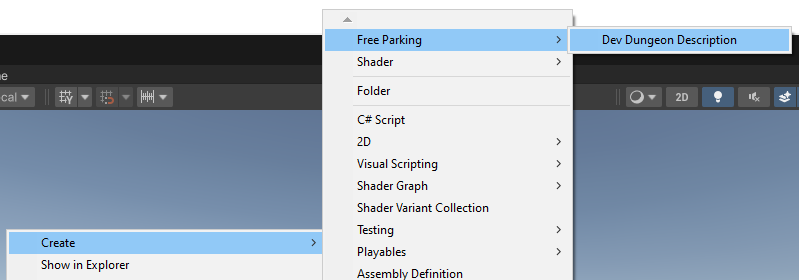
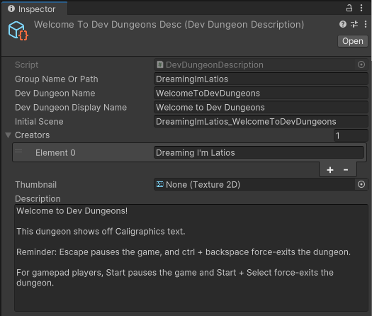
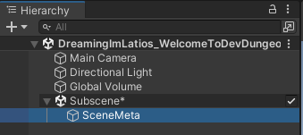
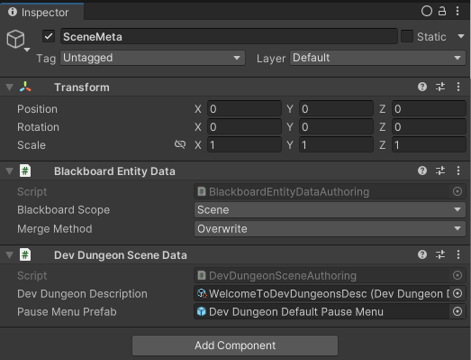
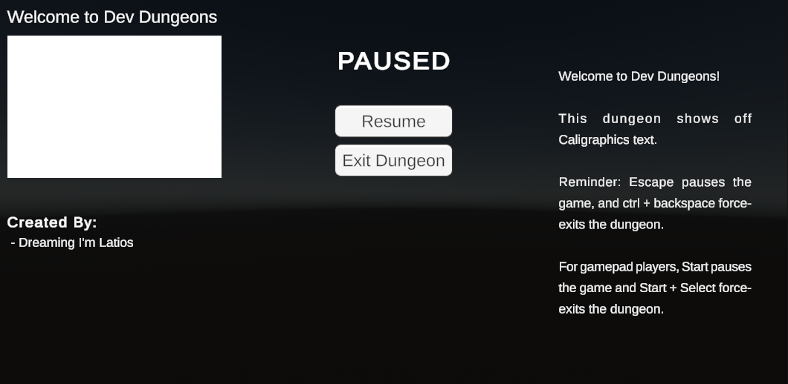
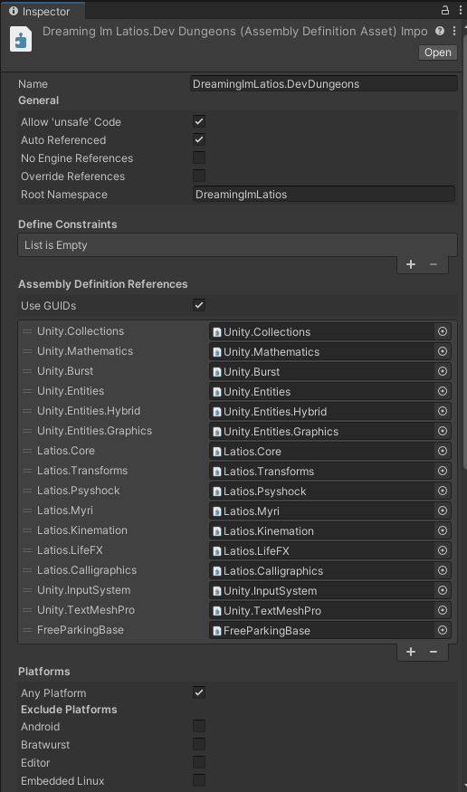
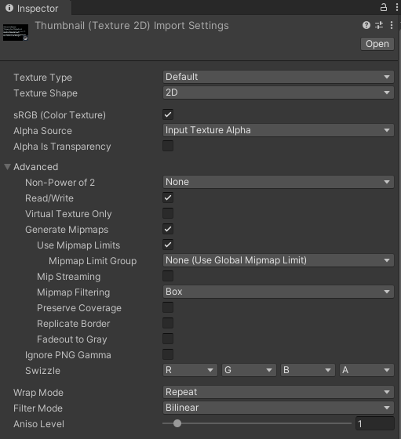
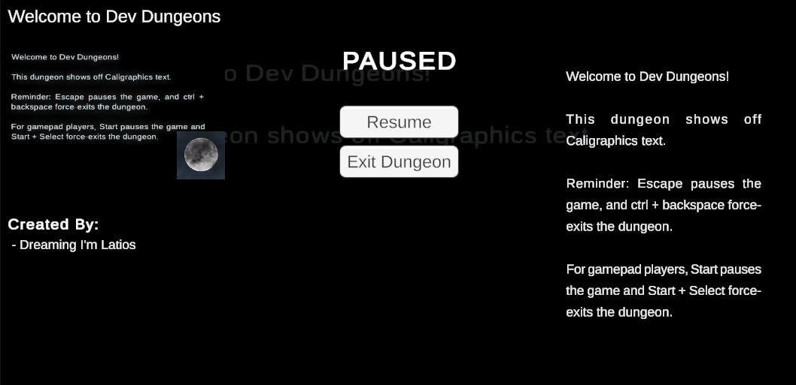

# Creating a Dev Dungeon Manually

Dev Dungeons allow you to experiment with many different ideas and features.
However, there are still a few mandatory steps to ensure the dev dungeon is
isolated and compatible with everything else. This guide walks through the
manual process of creating a dev dungeon completely from scratch.

## Creating Directories

The first thing you need to do is navigate to the *Dev Dungeons* folder inside
of Assets and create a new folder with your username.


Inside this folder, you will want to create another folder for your actual dev
dungeon. If you plan to create multiple dev dungeons and desire additional
folder nesting, you may do so.


## Creating the Dev Dungeon Description

Right click in the Project inside your new dev dungeon folder and create a new
*Dev Dungeon Description*.



Next, fill out the various fields in the inspector.

The *Group Name Or Path* will be combined with the *Dev Dungeon Name* to provide
a runtime path that systems can use to limit execution to only when your dev
dungeon is loaded. You can use / delineated paths if you wish for systems to run
for multiple dev dungeons. For example, you could have multiple dungeons inside
the path *YourUserName/PhysicsExperiments* and have systems that run in any dev
dungeon which use that path, but do not run if instead the dev dungeon has the
path *YourUserName/AnimationExperiments*.

The initial scene will be the name of the first scene the player loads into from
the main world when entering the dev dungeon. Scene names must be unique across
the entire project, so it is recommended to use a naming scheme to help ensure
this.

The thumbnail is optional, and likely not ready to be populated at this time.



## Creating a Scene

Create a new scene using the *Standard (URP)* template. Save the scene with the
same name you provided in the *Initial Scene* field of the Dev Dungeon
Description. **Make sure the names match exactly!**


Next, in your dev dungeon scene, create a subscene. The subscene name does not
have to be unique within the Free Parking project.

Inside the subscene, create an empty Game Object.



On this Game Object, attach a *Latios* *Core* *Blackboard Entity Data* component
and set the *Blackboard Scope* to *Scene*. Then attach a *Free Parking  Dev
Dungeon Scene Data* component. Drag your *Dev Dungeon Description* into the *Dev
Dungeon Description* field. For the *Pause Menu Prefab*, you can use the prefab
found in *Assets/Bootstrap* named *Dev Dungeon Default Pause Menu*.



You should now be able to enter play mode. By pressing the ESC key, you should
see the pause menu with various details populated with your *Dev Dungeon
Description*.



If your dev dungeon uses multiple scenes, you must perform this setup for each
scene. It is recommended you make a prefab for your Game Object with the *Dev
Dungeon Scene Data* component.

## Adding Code

While not strictly necessary, it is highly recommended that you create Assembly
Definition files for your dev dungeon code. Assembly Definition files
drastically speed of iteration times by only recompiling your dev dungeon code
whenever you make changes, and not the entire Free Parking project. You may
choose to have as many Assembly Definition files as you like, but for
simplicity, you may also choose to only have one for all your dungeons.


You will also need to supply all the Assembly Definition References.



You can now add your normal ECS files.


However, there’s one particular gotcha with Free Parking. Free Parking uses the
Explicit System Order workflow for system ordering. While this isn’t required in
your own projects using the Latios Framework, it is a feature that many are
surprised they like after trying it. Additionally, for Free Parking, it helps
keep dev dungeons isolated.

In order for your systems to execute, they need to be updated by a
`RootSuperSystem`. This `RootSuperSystem` will also be responsible for ensuring
your systems only execute when your dev dungeon is loaded. You can create
multiple `RootSuperSystem`s, and each one should look similar to the following
example:

```csharp
using FreeParking;
using Latios;
using Latios.Transforms;
using Unity.Entities;

namespace DreamingImLatios.Welcome.Systems
{
    // You can use normal [UpdateInGroup()] and [UpdateBefore/After()] attributes here
    // to position this group relative to other Latios Framework and Unity systems.
    // RootSuperSystem is a derived class of ComponentSystemGroup.
    public partial class WelcomeSuperSystem : RootSuperSystem
    {
        bool m_isActive           = false;
        bool m_requiresEvaluation = true;

        protected override void CreateSystems()
        {
            // This is where you explicitly specify the systems you want to update in this group.
            // They will be updated in the order specified.
            GetOrCreateAndAddUnmanagedSystem<AnimateWelcomeTextSystem>();
        }

        public override void OnNewScene()
        {
            m_requiresEvaluation = true;
        }

        public override bool ShouldUpdateSystem()
        {
            if (sceneBlackboardEntity.HasComponent<PausedTag>())
                return false;

            if (m_requiresEvaluation)
            {
                m_requiresEvaluation = false;
                if (!sceneBlackboardEntity.HasComponent<CurrentDevDungeonDescription>())
                {
                    m_isActive = false;
                    return false;
                }

                var description = sceneBlackboardEntity.GetComponentData<CurrentDevDungeonDescription>();

                // Pass in the path to your dev dungeon.
                // Note that this is a "starts with" filter.
                // If I were to only pass in "DreamingImLatios" as the path,
                // then this group would update for all my dev dungeons.
                m_isActive = description.CurrentDevDungeonPathStartsWith("DreamingImLatios/WelcomeToDevDungeons");
            }

            return m_isActive;
        }
    }
}
```

## Adding Other Things

At this point, you may continue to add to your dev dungeon. You can work with
the scene, add your authoring components to Game Objects, and iterate your ideas
in play mode.

If you need input, create an Input Actions for either your dev dungeon or in
your username folder to be shared across all your dev dungeons.

## Adding a Thumbnail

Now that you have a functional dev dungeon, it is time to go back and create
that thumbnail for your description. Use whatever image creation workflow you
prefer. It is a good practice to include a user profile as a watermark on the
thumbnail so that players can quickly identify when multiple dev dungeons are
created by the same creator.

Import the thumbnail into Unity, set *Power of Two* mode to *None*, and mark as
*Read/Write*.



Now when you enter mode and press ESC, you will see your thumbnail in the pause
menu.



## Sharing Your Dev Dungeon

Now that you have something you are ready to share with the broader community,
it is time to create a pull request. But before you do, make sure to add your
name to the credits. Go into the Bootstraps folder of the Free Parking and open
Credits.md in a text editor. Add your name under the *Dev Dungeons* heading,
leaving blank lines before and after.

Next, create your pull request. When you do so, be wary of any modified assets
that are outside of your dev dungeon username folder. Make sure such
modifications are intentional.

If you would like the community to review parts of your code to provide
suggestions, make sure to request such in your pull request.

Congrats! You made it to the end of this guide! Now go make some awesome dev
dungeons!
